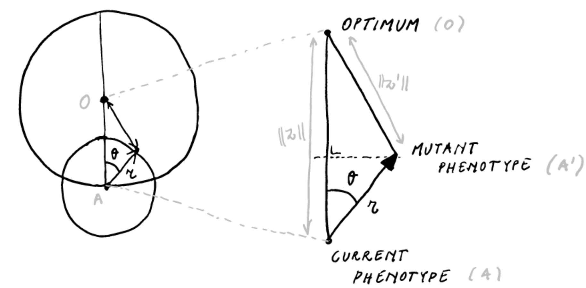
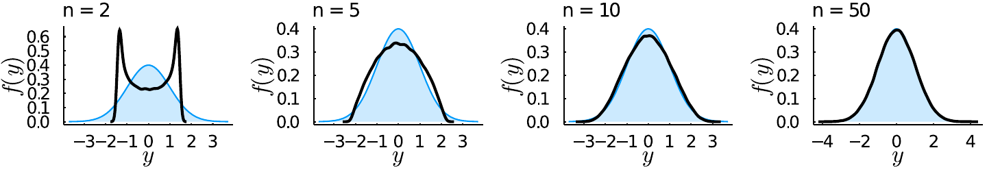
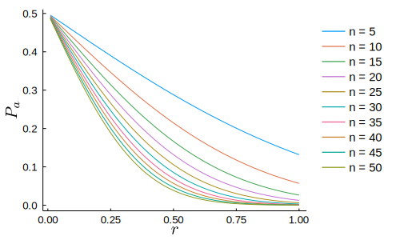
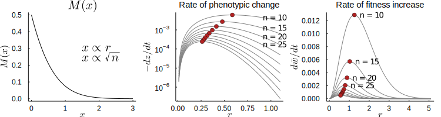

\newcommand{\norm}[1]{\Vert #1 \Vert}
\newcommand{\real}{\mathbb{R}}
\newcommand{\Ex}{\mathbb{E}}
\newcommand{\nz}{\Vert z \Vert}
\newcommand{\nzt}{\Vert z(t) \Vert}
\newcommand{\nzdt}{\Vert z(t + \delta t) \Vert}
\newcommand{\delz}{\Delta z}

*The following is based on a polishing of some notes I made for a
presentation on H. A. Orr's paper "Adaptation and the cost of complexity"
[@orr2000] for our reading group on 'concepts and models in evolution' at
Ghent university (January 2021).*

-----------

I will start by discussing some of the basics of Fisher's Geometric model
(FGM). Then I will switch to Orr's paper. What Orr is after is a model of
adaptation at the phenotypic level that is grounded in population
genetics, with phenotypic complexity as a parameter. To this end, he
builds on the work of @kimura1983, which makes the connection between FGM
and the population genetics of selection.

## Fisher's geometric model (FGM)

In the section "The nature of adaptation" (p. 38) of @fisher1930, Fisher asks
what we mean when we recognize an organism as adapted.

>"In order to consider in outline the consequences to the organic world
of the progressive increase of fitness of each species of organism, it is
necessary to consider the abstract nature of the relationship which we term
'adaptation'. This is the more necessary since any *simple* example of
adaptation, such as the lengthened neck and legs of the giraffe as an
adaptation to browsing on high levels of foliage, or the conformity in average
tint of an animal to its natural background, lose, by the very simplicity of
statement, a great part of the meaning which the word really conveys. For the
more complex the adaptation, the more numerous the different features of
conformity, the more essentially adaptive the situation is recognized to be."
(emphasis original)

Clearly, when we think of adaptation, we are tempted to consider those obvious
examples like the giraffe, but as Fisher wants to stress in this opening
paragraph, this is misguiding us. Most of the extraordinary adaptation in
nature can not be recognized as a simple one-to-one correspondence between an
environmental challenge and a phenotype, but is rather reflected by the subtle
fine-tuning of complex organisms to complex environments. The ability to
maintain homeostasis in a given array of conditions seems to be the ultimate
example of such a phenotype. Already in this opening paragraph, the
correspondence between *complexity* and *dimensionality* is explicitly posited. 

>"The statistical requirements of the situation, in which one thing is to
conform to another in a large number of different respects, may be illustrated
geometrically. The degree of conformity may be represented by the closeness
with which a point $A$ approaches a fixed point $O$. In a space of **three
dimensions** we can only represent conformity in three different respects, but
even with only these the general character of the situation may be represented.
The possible positions representing adaptations superior to that represented by
$A$ will be enclosed by a sphere passing through $A$ and centred at $O$. If $A$
is shifted through a fixed distance, $r$, in any direction its translation will
improve the adaptation if it is carried to a point within this sphere, but will
impair it if this position is outside. If $r$ is very small, it may be
perceived that the chances of these two events are approximately equal, and the
chance of an improvement tends to the limit $1/2$ as $r$ tends to zero; but if
$r$ is as great as the diameter of the sphere or greater, there is no longer
any chance whatever of improvement, for all points within the sphere are less
than this distance from $A$. For any value of $r$ between these limits the
actual probability of improvement is $\frac{1}{2}(1-r/d)$ where $d$ is the diameter of
the sphere.  The chance of improvement thus decreases steadily from limiting
value $1/2$ when $r$ is zero, to zero when $r$ equals $d$.  Since $A$ in our
representation may signify either the organism or its environment, we should
conclude that a change on either side has, when this change is extremely
minute, an almost equal chance of effecting improvement or the reverse; while
for greater changes the chance of improvement diminishes progressively,
becoming zero, or at least negligible, for changes of a sufficiently pronounced
character." (emphasis mine)

Here Fisher defines his famous geometric model in 3D. Let us however define
Fisher's model in general first, then we'll consider the 2D variant, to finally
generalize to the high-dimensional case.

FGM is a model of *phenotypic evolution*. A biological entity (this can be an
individual or a population), is modeled as a point $A$, in an $n$-dimensional
vector space $\mathbb{R}^n$ -- the phenotypic space. The phenotypic space is
characterized by a single optimal phenotype, which we identify (without loss of
generality) with the origin of the space $O$. That is, we choose the basis of
the vector space such that the optimum is the zero vector $\mathbf{0}$, and
such that any phenotypic state $A$ in this space can be identified with the
vector $z$ pointing from the optimum to the relevant point. If we take this
vector space to be a normed Euclidean space, the distance from the optimum for
any given point $z$ is then the Euclidean norm $\norm{z}$. Clearly, this model
amounts to treating an organism as a list of $n$ orthogonal characters.

Those are the statics of the model, for any given two phenotypic states $z_1$
and $z_2$, we can say which one exhibits a higher degree of adaptation (i.e.
the one closest to the optimum, as measured by the Euclidean norm). Evolution
in the model happens by mutation, where a mutation takes the current phenotype
represented by point $A$ to a point $A'$ by moving a distance $r$ in a random
direction from the point $A$. In other words, the phenotype after a random
mutation is distributed uniformly on the $n$-ball (hypersphere) around $A$ with
radius $r$. The mutation can be represented as a vector $\rho$ with
$\norm{\rho} = r$, so that the phenotype after mutation $z' = z + \rho$. An
important assumption embodied by this mutation mechanism is what is referred to
as **universal pleiotropy**, i.e. every mutation affects *all* traits (the set
of vectors of zero magnitude in any direction has measure 0, i.e. a random
vector with norm $r$ in $\mathbb{R}^n$ is non-zero in every direction with
probability 1).

### FGM in two dimensions

Let's see what we can get from considering this model in $\real^2$ by pondering
the following diagram

{width=100%}

For a given mutation effect size $r < \norm{z}$ and current distance to the
optimum $\norm{z}$, the distance moved towards the optimum $\Delta z$ can be
expressed as a function of $\theta$

$$\Delta z(\theta) = \norm{z} - \sqrt{\norm{z}^2 -2\norm{z} r \cos \theta +
    \frac{r^2}{2}} \approx r \cos \theta - \frac{r^2}{2 \norm{z}}$$

(**Note** I am not so sure what justifies the approximation of the former by the latter.
A Taylor series expansion in $r = 0$ seems to go some way, but not all the way
as far as I can tell). In $\real^2$, the assumption that the mutation has a
random direction in the plane amounts to $\theta \sim
\mathrm{Uniform}(0,2\pi)$, so that we can find using the approximate form for
$\Delta z$, we find that the probability of a mutation being adaptive is 

$$P_a = \Pr\{\Delta z > 0\} \approx 
    \Pr\{\theta > \cos^{-1} r/2z\} = 1 - \frac{\cos^{-1} r/d}{2\pi}$$

### FGM in three and higher dimensions

In higher dimensions, $\Delta z(\theta)$ remains unaltered, i.e. we still have
the triangle $AA'O$, and we can still express the distance moved towards the
optimum as the same function of $\theta$. However, $\theta$ will no longer be
uniformly distributed on $(0, 2\pi)$. For the 3D case, we can work it out using
the volume of the [spherical
lens](https://mathworld.wolfram.com/Sphere-SphereIntersection.html) divided by
the volume of a sphere with radius $r$, for which I get $P_a =
\frac{1}{2}\big(1 - \frac{3r}{4d}\big)$ for the probability of improvement
(which is not exactly Fisher's probability). Importantly, $P_a$ in $\real^3$ is
different from $P_a$ in $\real^2$. 

However the question remains whether we can find an (approximate) expression for
$P_a$ in any dimension. Here is Fisher:

>"The representation in three dimensions is evidently inadequate for
even single organ, in cases in which we know enough to appreciate the relation
between structure and function, as is, broadly speaking, the case with the eye
in vertebrates, often shows this conformity in many more than three respects.
It is of interest therefore, that if in our geometrical problem the number of
dimensions be increased, the form of the relationship between the magnitude of
the change $r$ and the probability of improvement, tends to a limit [...]"

As @leigh1987 supposedly showed (I'm not sure, I cannot retrieve this paper),
the limit postulated (but not explicitly derived) by Fisher can be obtained by
considering the change of variables 

$$y = \sqrt{n} \cos \theta$$ 

and noting that for $n \gg$, we get that $y$ approximately follows a standard
Normal distribution. The derivation involves some nasty integrals (see e.g.
@welch2003 appendix 1), but there are reasons why it is unsurprising to find
the Normal distribution here (the multivariate Normal distribution exhibits
spherical symmetry, i.e. the probability density is invariant to rotations, as
we assume for mutations in FGM). Here are some simulation results, where I 
simulated random points on the Euclidean $n$-ball and computed $y$:

{width=100%}

Where in black the simulated values for $y$ are shown and in blue the standard
normal density. Starting from $n \ge 10$ the Normal approximation becomes very 
good.

If we execute the change of variables, we get

$$\Delta z(y) \approx \frac{r}{\sqrt n} \Big(y - \frac{r\sqrt n}{2 \norm{z}}\Big)$$

Which shows that given the current distance to the optimum $\norm{z}$, for a
mutation of given size $r$ to be adaptive $y$ must exceed $x := \frac{r\sqrt{n}}{2
\norm{z}}$, so that 

$$P_a = 1 - \Phi(x)$$ 

Where $\Phi(x)$ is the cumulative distribution function of the standard Normal
density. of course $1-\Phi(x)$ is monotonically decreasing in $x$, so we find
Fisher's result that the probability that a mutation leads to improvement is
highest for infinitesimally small mutations, and declines progressively for
larger $r$. Note that $x > 0$, so that the maximal $P_a = 1/2$. Interestingly,
since $x \propto \sqrt{n}$, we also find that this decline in the probability
of a mutation leading to adaptation decreases quite markedly with increasing
dimensionality $n$, the parameter that corresponds to, on Fisher's
interpretation, organismal complexity (and which, in a less bold
interpretation, corresponds to the number of orthogonal characters relevant for
adaptation). This is the first manifestation of the **cost of complexity**, for
mutations of a given size $r$ and given some degree of maladaptation
$\norm{z}$, the probability of a mutation being adaptive decreases with
increasing complexity $n$.

This probability is the central result of FGM.  This is actually [a reflection
of a very general geometrical phenomenon, namely that in *high-dimensional
spaces it is very hard to locate some point or region*. If you are situated at
some distance $d$ from a point $O$ in some $n$-dimensional space, and you move
in a random direction by some distance $r < d$, the likelihood that you'll get
closer to the point $O$ decreases exponentially as the dimensionality
increases. As a mathematician once put it: [high-dimensional space is a lonely
place](https://betanalpha.github.io/assets/case_studies/probabilistic_computation.html).

## Orr's model of adaptation

FGM as sketched above is not a complete model of evolution. In fact, it doesn't
tell us much about how a population evolves, except that mutations of larger
effect are less likely to be advantageous in more 'complex' organisms.

To build a model of evolution under FGM, we need

- a mutation *process*
- a relationship between phenotype and fitness (a *fitness function*)

So far we have only considered properties of FGM *given* some random FGM
mutation, but we have said nothing about how often mutations of a given effect
will occur during evolution. Moreover, and this is of crucial importance, if we
consider $z$, the point in space moving towards the optimum, as a *population*
(as Orr does), we must take into account the probability that a mutation *fixes
in the population*, and leads to a persistent change in the mean phenotype $z$.
This fixation probability will depend on the change in *fitness* caused by the
mutation.

We will consider Gaussian stabilizing selection, so that the fitness of an
individual with phenotype $z$ is given by

$$ w(z) = \exp (-\norm{z}^2) $$

and we consider mutations of fixed size $r$ happening at a rate $\mu$ per
individual, so that the total mutation rate for a population of size $N$ is
$N\mu$.

Now for some **simplifying assumptions**, Orr considers a monomorphic
population residing at a distance $\norm{z}$ from the optimum, where every
mutation is either fixed or lost before the next one occurs (i.e. $N\mu$ is
fairly small).  Orr further assumes that deleterious mutations are never fixed
by random drift.

Under this model, the **expected distance moved to the optimum** in a small
time interval will be

$$\Ex[\Delta z(\delta t)] = \Ex[\Delta z|\text{fix}] 
        \times \underbrace{P[\text{fix}|\text{adv}]}_{\Pi}
        \times \underbrace{P[\text{adv}|\text{mut in } \delta t]}_{P_a} 
        \times \underbrace{P[\text{mut in } \delta t]}_{(N\mu)\delta t}$$

So that **the rate of phenotypic change**

\begin{align*}
   \frac{d \nzt}{d t} &= \lim_{\delta t \rightarrow 0}\frac{\nzdt - \nzt}{\delta t} \\
   &\color{lightgray}{= \lim_{\delta t \rightarrow 0}
        \frac{(\nzt - \Ex[\Delta z(\delta t)]) - \nzt}{\delta t}} \\ 
   &\color{lightgray}{= \lim_{\delta t \rightarrow 0}
        \frac{- \Ex[\Delta z(\delta t)]}{\delta t}} \\ 
   &= -(N \mu) \times \Pi \times P_a \times \Ex[\Delta z|\text{fix}]
\end{align*}

(note that this is in fact the rate of change of the *expected* distance to the
optimum $d\Ex\nzt/dt$ , but I will follow Orr in blurring this distinction).

If we measure time in the number of mutations produced, we get

$$ \frac{d \nz}{dt} = - \Pi \times P_a \times \Ex[\Delta z | \text{fix}] $$

We know $P_a$ from the properties of FGM discussed above. To make progress we
need to find $\Pi$ and $\Ex[\Delta z | \text{fix}]$ as functions of the
parameters in the model (which consists of nothing more than $z$, $r$, $y =
\sqrt{n} \cos \theta$ and $n$).

### The probability of fixing an advantageous mutation

$\Pi$ is given by fairly standard results from population genetics theory. The
probability of fixing an adaptive mutation is given by Haldane's approximation
(also by diffusion theory) as $2s$ when $s$ is not too large, where $s$ is the
selection coefficient in favor of the mutation. The selection coefficient for a
mutation moving $\Delta z$ towards the optimum is defined as

$$ \frac{1+s}{1} = \frac{w(z - \Delta z)}{w(z)} $$

Now Orr considers Gaussian stabilizing selection, so that for a mutation that
moves us a distance $\Delta z$ towards the optimum, we get a selection coefficient

$$s = \frac{\exp(-\frac{1}{2}(\nz - \Delta z)^2/2)}{\exp(-\frac{1}{2}\nz^2)} - 1 = 
	\exp\Big(\nz\Delta z - \frac{\Delta z^2}{2}\Big) - 1$$

(note that there is a typo in Orr). For $\Delta z$ smallish we have

$$s \approx \exp(\nz \Delta z) - 1 \approx \nz \Delta z$$

The *expected* selection coefficient for advantageous mutations is then

$$\Ex[s|\text{adv}] \approx \nz \Ex[\Delta z | \text{adv}]$$

so that the fixation probability conditional on a mutation being advantageous
becomes becomes 

$$\Pi \approx 2 \nz \Ex[\Delta z| \text{adv}]$$

Now we've obtained

$$ \frac{d \nz}{dt} = - 2  \nz \times P_a \times \Ex[\Delta z| \text{adv}]
\times \Ex[\Delta z | \text{fix}] $$

### The expected phenotypic change under FGM

Now the somewhat more tedious part is to find $\Ex[\Delta z| \text{adv}]$ and
$\Ex[\Delta z| \text{fix}]$. These can be found from the properties of FGM.
$\Ex[\Delta z| \text{adv}]$ can be straightforwardly obtained by integrating
$i\Delta z$ over advantageous mutations. For clarity of the probabilistic
concepts, I'll write a mutation being advantageous as a binary random variable
$A = \mathbb{1}_\text{adv}$ 

\begin{align*}
\Ex[\delz|A=1] &= \int_{\delz} \delz p(\delz|A=1) d\delz \\
    &= \frac{1}{P_a}\int_{\delz} p(\delz, A=1) d\delz 
\end{align*}

Note that

$$p(\delz, A=1) = \begin{cases} 0 & \delz < 0 \\ p(\delz) & \delz \ge 0\end{cases}$$

so that

\begin{align*}
\Ex[\delz|A=1] &= \frac{1}{P_a}\int_0^\infty p(\delz) d\delz \\
    &= \frac{r}{\sqrt{n}} \frac{\int_{x}^\infty (y - x) \exp(-y^2/2) dy}
        {\int_x^\infty \exp(-y^2/2)dy} 
\end{align*}

(note that the denominator is $\sqrt{2\pi} P_a$). Slightly more cumbersome is
the derivation of $\Ex[\delz|F=1]$ (where of course $F =
\mathbb{1}_\text{fix}$)

\begin{align*}
\Ex[\delz |F = 1] = \Ex[\delz|F=1, A=1] 
    &= \int_{\delz} \delz \frac{p(\delz, F=1|A=1)}{p(F=1|A=1)} d \delz \\
    &= \int_{\delz} \delz \frac{p(F=1|\delz, A=1)p(\delz|A=1)}
        {\int_{\delz}p(\delz,F=1|A=1)p(\delz|A=1)} d \delz \\
    &= \int_{\delz} \Bigg[ \frac{\delz \Pi(\delz) p(\delz|A=1)}
        {\int_{\delz}\Pi(\delz) p(\delz|A=1) d\delz} \Bigg] d\delz
\end{align*}

Where (recall) $\Pi(\delz) \approx 2 \nz \delz$ for small $\delz$. The integral in
the denominator is a normalizing constant, so that we get

\begin{align*}
\Ex[\delz |F = 1] &= \frac{\int_{\delz} \delz^2 p(\delz|A=1)d\delz}
        {\int_{\delz}\delz p(\delz|A=1)d\delz} \\ 
    &= \frac{r}{\sqrt{n}} \frac{\int_{x}^\infty (y-x)^2 \exp(y^2/2) dy}
        {\int_x^\infty (y-x) \exp(y^2/2)dy}
\end{align*}

and finally we get 

$$\Ex[\Delta z|\text{adv}] E[\Delta z|\text{fix}] = \frac{r^2}{n}
	\frac{\int_x^\infty (y - x)^2 \exp(-y^2/2) dy}
         {\int_x^\infty \exp(-y^2/2)dy}$$

Let the mathematicians laugh at my lengthy and probably silly derivations, but there
are no more secrets here to me!

### The rate of phenotypic change and the rate of adaptation

We are now ready to express the rate of phenotypic change during adaptation in
terms of the parameters of FGM. Multiplying by $-2\nz P_a$, we arrive at

$$\frac{d \nzt}{dt} \approx - \frac{2 \nzt r^2}{n\sqrt{2\pi}}
        \int_x^\infty (y - x)^2 \exp(-y^2/2) dy$$

where $x = \frac{r\sqrt{n}}{2\nzt}$. We can write this more clearly as

$$\frac{d \nzt}{dt} \approx - \frac{2r^2}{n} M(x) \nzt $$

where $M(x)$ decreases monotonically in $x$. **The rate of adaptation** can
then be found by an application of the chain rule $\frac{d w(z)}{dt} = \frac{d
w(z)}{d \nzt} \frac{d \nzt}{dt}$, i.e.

$$\frac{d w(t)}{dt} = \frac{2r^2}{n} M(x) w(t) \nzt^2$$

which can be written in terms of fitness exclusively by substituting $\nzt^2 =
-2 \log{w(t)}$ (also in $x$)

$$\frac{d w(t)}{dt} \approx - \frac{4r^2}{n} M(x) w(t) \log w(t) $$

Note that $\log{w(t)} \le 0$, so that the rate of change in fitness is strictly
positive, i.e. under this model fitness can only increase. Also note how that 
$w(t) \log{w(t)}$ term looks suspiciously like an entropy term (but note that
$w(t)$ is not a probability). The following plot illustrates these results for
various $n$ and mutation effect sizes $r$:

{width=100%}

## The optimal mutation and the cost of complexity

Three important observations must be made:

1. The optimal mutation effect size $r$ (i.e. the $r$ leading to most rapid
adaptation) is intermediate.
2. The optimal $r$ decreases for increasing $n$.
3. The maximal and average (over $r$) rate of adaptation decreases with increasing $n$.

The first point is a qualitative feature independent of the dimensionality $n$
of the space. It is a straightforward consequence of combining FGM with the
population genetics of selection, which Orr attributes to Kimura. While
mutations of large effect have smaller probabilities of being advantageous
(FGM), they are more likely to fix in the population when advantageous
(popgen). Or, stated the other way around, mutations of small effect may be
more likely to be adaptive, they are more likely to get lost due to genetic
drift at the same time. The combination of FGM with the population genetics
of selection in finite populations leads to a model which provides a quite
elegant refutation of the micromutationist stance that is sometimes associated
with a particular hardcore brand of neo-Darwinism.

The 'cost of complexity' as proclaimed in the title of Orr's paper however
emerges when we consider the effect of $n$, the dimensionality of the
phenotypic space. First recall that in the model, $n$ is properly interpreted
as the number of orthogonal traits under stabilizing selection for a given 
constant optimum, and that the assumption of *universal pleiotropy* entails 
that any mutation affects *all* $n$ idealized traits almost surely. As we
increase the number of phenotypic dimensions relevant for adaptation, we see
that the rate of adaptation for a given $r$ and current distance $\nz$ from the
optimum decreases markedly. This phenomenon is referred to as the cost of
complexity. More complex organisms (on this interpretation) adapt more slowly.

The cost of complexity has three sources

1. The probability of a mutation being advantageous for a given effect size $r$
   decreases with $n$ (Fisher)
2. The expected phenotypic change of a favorable mutation decreases with $n$
   (a consequence of (1))
3. The expected phenotypic change for a fixed mutation decreases with $n$ 

while the latter two aspects are consequences of the first, they enter the
final expression for the rate of fitness increase during adaptation
independently. As Orr notes, Fisher's basic observations hold, but the cost of
complexity is considerably higher than Fisher's analysis suggests if we
take into account the population genetics of selection in finite populations.

## Some remarks about FGM

>"The purpose of models is not to fit the data but to sharpen the question." -- 
Samuel Karlin

### Orr's effective number of dimensions

A curious result that follows from Orr's model, is that while the optimal $r$
decreases for increasing $\sqrt{n}$, on the standardized scale determined by $x
= r\sqrt{n}/2z$, the optimal mutation size $x_\mathrm{opt}$ is a constant
approximately equal to 0.95. 

This entails that if we could locate the mutation effect size that maximizes
the change in fitness in some situation, we could use the FGM predictions to
estimate the $n$ under the assumptions of FGM. We could than consider this
$n_e$ a kind of 'effective number' of phenotypic dimensions *under selection*,
much like effective population size is defined with respect to some idealized
population. Clearly this is more of a thought experiment than a truly useful
result. But the idea is clear and potentially useful, if we would have more
easily measurable properties of FGM we might be able to meaningfully estimate a
thing like $n_e$. This would turn a model that is of course manifestly wrong in
many ways into a model that could bring insights into the complexity of the
genotype-phenotype map underlying some trait, much like the effective
population size in population genetics captures key features of the
reproductive dynamics of a population.

### Robustness results of Welch and Waxman

These are very interesting! [@welch2003]

### Comparing across different $n$ and trans-dimensional mutations

While FGM is an altogether extremely gross simplification of phenotypic
evolution (universal pleiotropy, a single optimum, frequency independence, etc.
etc. *ad infinitum*), a notion completely lacking from the model which I find
interesting is the possibility of mutations that increase or decrease
complexity. This gets of course directly to the core of the issue with FGM and
Orr's analysis, are we sure our comparisons across different $n$ are even
meaningful? What, for instance, if the optimum in dimension $n$ corresponds to
a lower absolute fitness then the optimum in dimension $n+1$? Or, given the
cost of complexity, it seems natural to assume that a complexity decreasing
mutation (that preserves functionality) can invade a population, all else being
equal. Much to think about here.

---------   

*Last updated: January 2021*

*Note:* I am of course aware of R.A. Fisher's reputation as a particular 
virulent eugenicist. The fact that I study his work (like his book "The genetical 
theory of natural selection", of which the second half is concerned with human
genetics and eugenics) does not mean I value his eugenic theories.
