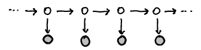
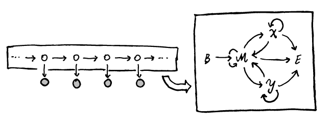

--- 
title: Pair hidden Markov models 
---

Pair hidden Markov models (pair HMMs, or pHMMs) were introduced, as
far as I can tell, by Durbin *et al.* (1999), in what I heard veterans
call 'the Durbin book' (Biological Sequence Analysis, or BSA).  These
are beautiful probabilistic models that can be used for model-based
pairwise alignment of sequences. As I was studying these, it seemed
worthwhile to write down some notes, since the subject turned out to
be somewhat more difficult than I thought (as a matter of fact, I
thought I already understood how pHMMs worked, but that turned out to
be only partly true when I actually needed one).

An ordinary hidden Markov model (HMM) is best understood by its
probabilistic graphical model (PGM) representation

Recall that a PGM displays conditional dependence relationships among
random variables. White circles usually denote unobserved ('latent')
variables, whereas grey circles denote observed ('clamped') variables.
In the above PGM, the white nodes display the 'hidden' states, which
form a Markov chain, each variable being conditionally dependent on
the preceding one.  With each hidden state $Z_i$, one random variable
$X_i$ with law $X_i|Z_i \sim f$ conditionally dependent on the hidden
state is associated, a realization of which constitutes the observed
data.  Clearly, such a probabilistic structure could be used to model
a time series or a (biological) sequence (for instance). The
probability law generating the observations conditional on the hidden
states is often called the 'emission model'.  A classical example
would be a model for some DNA sequence, where hidden states $Z_i$
could for instance correspond to whether or not a position $i$ is in
($Z_i = 1$) or not in ($Z_i = 0$) a `CpG` island.  The emission model
would correspond to a multinomial probability law with parameter
$\theta_i$ depending on the hidden state. After specifying the
transition probabilities $p_{ij} = \Pr(Z_{i+1} = i|Z_i =j)$ for hidden
states and the emission model $\theta_i|Z_i$, simulating from the HMM
as a generative model is straightforward.

A first thing to stress is that a pair HMM is *au fond* just a HMM: a
pair HMM has the same PGM as the one sketched above. There are however
two aspects to pair HMMs and their use for probabilistic alignment
which complicate things:

1. The Markov chain determining the hidden state transitions can be
   considerably more complicated than most textbook HMM examples.
2. We usually do not observe the data as emitted by the pair HMM.

Honestly, the first aspect is what brought about some initial
confusion, as I was used to looking at PGM diagrams, and got confused
by the graphical display of the Markov chain (which is also depicted
as a directed graph) *underneath* the hidden state part of the PGM,
somehow trying to fit it in the PGM view.
Specifically, the following two graphs depict two intimately related
aspects of a pair-HMM

On the left side we of course have the same PGM as above, but where I
put a box around what we have called the hidden nodes. On the right
hand side, the Markov chain which governs the different states taken
by the hidden nodes is displayed. So in this model, each hidden node
takes a value from the set $\{B,M,X,Y,E\}$, where transitions are 
allowed between neighboring states in the Markov chain.

The Markov chain over hidden states is determined by a transition
probability matrix. In the above example this could for instance be

$$P = \begin{pmatrix}
0 & 1-2\delta -\tau & \delta & \delta & \tau \\ 
0 & 1-2\delta- \tau & \delta & \delta & \tau \\
0 & 1-\epsilon-\tau & \epsilon & 0 & \tau \\
0 & 1-\epsilon-\tau & 0 & \epsilon & \tau \\
0 & 0 & 0 & 0 & 1 
\end{pmatrix}$$

with states ordered $(B,M,X,Y,E)$ this would correspond to the pHMM
for a global alignment as defined in the Durbin book.

