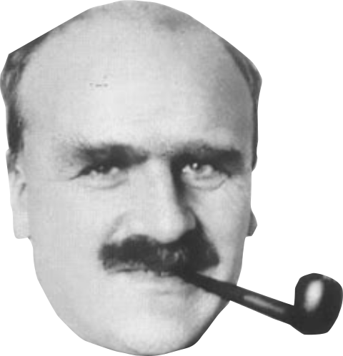

**What?** A reading group (journal club, if you will) for people interested in
theoretical aspects of evolutionary biology at Ghent University.

**Where?** Due to an ongoing pandemic, the meetings take place virtually.

**When?** The idea is to have *biweekly* meetings, starting from January 2021.
When exactly still needs to be decided.

**Format?** We'll have a max. 40 minutes presentation by the enthusiast who
picked the topic, followed by a discussion.

The [**scope**](suggestions.html) is evolutionary biology in a *broad* sense
(including eco-evo, evo-devo, evolutionary genetics and macroevolutionary
themes), but with a focus on *theoretical* aspects (i.e. not too much concerned
with technical aspects, neither mathematically, statistically nor
experimentally). The goal is not so much to scrutinize the latest hot research,
but rather to gain better or novel insights by trying to collectively
understand important 'concepts and models'. Clearly, the speaker is *not*
assumed to be a specialist of the matter that is discussed.

## Schedule

| Date | Topic | Reading(s) |
|------|-------|------------|
| January 8   | Fisher's geometric model of adaptation and the cost of complexity | Main: [Orr 2000](https://onlinelibrary.wiley.com/doi/epdf/10.1111/j.0014-3820.2000.tb00002.x), additional: [Tenaillon (2014)](https://www.annualreviews.org/doi/abs/10.1146/annurev-ecolsys-120213-091846?casa_token=DiwKYA9MpL4AAAAA:Yz1SsjoX5n4ynEeIh83as7K8lSCYXRw-g8Ljz8W0PVqz7CPdai21niNfQ4uBDBxDmNVjz_8OeW4), [Orr (2005)](https://doi.org/10.1038/nrg1523) (lighter on the maths), [Chapter 2 of Fisher (1930)](https://archive.org/details/geneticaltheoryo031631mbp/page/n61/mode/2up) (for enthusiasts, section: the nature of adaptation) | 
| January 22  | Complex adaptations and the evolution of evolvability | [Wagner & Altenberg (1996)](https://onlinelibrary.wiley.com/doi/abs/10.1111/j.1558-5646.1996.tb02339.x), additional: [Payne & Wagner (2018)](https://www.ieu.uzh.ch/wagner/papers/PayneWagner_NRG_2018.pdf) |
| February 5  | The holobiont concept in evolution                    | [Theis et al. (2016)](https://msystems.asm.org/content/1/2/e00028-16) and [Roughgarden (2020)](http://philsci-archive.pitt.edu/17655/1/holobiont-evolution-mathematical-model-with-vertical-vs.pdf)      |
| February 24 | Limits to adaptation along environmental gradients    | [Polechová and Barton (2015)](https://www.pnas.org/content/112/20/6401)                                                                                                                                      |

If you want to **propose and present** a paper or book chapter for discussion,
send an email to {width=200}

If you want to be added to the **mailing list**, send an email to that same address.

