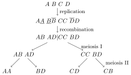

\renewcommand{\Pr}{\mathbb{P}}
\newcommand{\Ex}{\mathbb{E}}
\newcommand{\var}{\mathrm{var}}
\newcommand{\cov}{\mathrm{cov}}
\newcommand{\No}{\mathcal{N}}

Here I'll describe how one can adapt the infinitesimal model of quantitative
genetics to autotetraploid populations. I was interested in this mainly for the
purpose of studying the evolution of *mixed-ploidy* populations, but these
results may be interesting for their own sake.

# The infinitesimal for autotetraploid populations

In its purely phenotypic formulation, the infinitesimal model assumes that
offspring trait values $Z$ of a parental pair with trait values $z_i$ and $z_j$
are normally distributed:
    $$ Z_{ij} \sim \mathcal{N}\Big(\frac{z_i + z_j}{2}, V_{i,j}\Big) $$
where $V_{ij}$ is called the *segregation variance* and is determined by the
hereditary process. At the genotypic side, the basic infinitesimal model can be
derived as the limit of a model where a quantitative trait is controlled by $n$
unlinked Mendelian loci with additive effect $a$, as $n\rightarrow \infty$ and
$a\downarrow 0$. 

A slightly different, and perhaps more insightful, way to specify the same
model is to write $Z_{ij} = X_i + X_j$, where $X_i$ is the contribution of
parent $i$ to the genotypic value of the offspring and $X_j$ the same for $j$.
That is, $X_i$ is the genotypic value of a gamete from $i$.  For gametes
produced by a typical meiotic division, we assume $X_i \sim \No(z_i/2, V_i)$,
where $V_i$ is the contribution to the segregation variance from $i$.
Alternatively, we can call $V_i$ the *gametic variance* for individual $i$.
Segregation occurs independently in both parents, contributing additively to
the segregation variance  $V_{ij} = V_i + V_j$.
When considered as the limit of a large number of unlinked additive Mendelian
loci of small effect, we can partition the segregation variance in
contributions from each locus (assuming linkage equilibrium) 
    $$V_0 = \sum_{k=1}^n v_{0,k}$$
Where $v_{0,k}$ is the contribution to the segregation variance of the $k$th
locus. Considering this viewpoint explicitly often helps me in deriving
properties of the infinitesimal model.

If we assume a population consisting of unrelated individuals with genetic
variance $V$ and segregation variance $V_0$ for all parental pairs, we find
that under random mating the variance in the offspring generation is
\begin{align*}
V' &= \Ex[\var[Z_{ij}|Z_i, Z_j]] + \var[\Ex[Z_{ij}|Z_i,Z_j]] \\
   &= \Ex[V_{ij}] + \var\bigg(\frac{Z_i + Z_j}{2}\bigg) \\
   &= V_0 + \frac{V}{2}
\end{align*}
So that at equilibrium ($V' = V$), the trait distribution for the population
will be Gaussian with variance $2V_0$.

## Inbreeding and the evolution of the segregation variance

Importantly, $V_{ij}$ is not a function of $z_i$ or $z_j$ (although they may
be correlated), but nevertheless evolves over time.
For a finite population, inbreeding will lead to an increase in homozygosity
and cause the segregation variance to decrease over time.
Indeed, from the viewpoint of the Mendelian limit, it is clear that in the
extreme case where an idividual is completely homozygous for all loci affecting
some trait, Mendelian segregation does not generate any variance, and all
gametes of such an individual have, barring mutation, the same genotypic value.
Importantly, while the basic phenotypic model (where offspring traits are
distributed according to a Gaussian around the midparent value) holds for
arbitrary ploidy levels, genetic drift -- and consequently, the evolution of
the segregation variance in finite populations -- will differ for different
ploidy levels.

The infinitesimal model for finite populations of haploid and diploid
individuals is described in detail in @barton2017.
We shall use a slightly different notation here.
Let $F_i$ be the inbreeding coefficient of individual $i$, i.e. the probability
that two *distinct* genes sampled from individual $i$ are identical by descent
(IBD).
Let, furthermore, $\Phi_{ij}$ be the coancestry coefficient of individuals $i$
and $j$, or the probability that two genes sampled independently from
individuals $i$ and $j$ are IBD.
Note that for any ploidy level $m$, we have the relationship 
$$\Phi_{ii} = \frac{1}{m}(1+(m-1)F_i)$$

In **haploids**, the situation is somewhat different from other ploidy levels,
owing due to the absence of reduced gametes in sexual reproduction.
While we have no notion of homozygosity for an individual haploid individual,
whenever a pair of alleles at some locus in a mating pair of individuals is
IBD, Mendelian segregation during meiosis after syngamy will fail to
contribute to the segregation variance.
For a haploid parental pair $(i,j)$, the segregation variance is reduced to
    $$V_{ij} = V_0(1-\Phi_{ij})$$
Now, for diploids and higher ploidy levels, the situation is different, since
Mendelian segregation happens in the generation of gametes through meiosis.
Segregation hence happens independently in the generation of the two gametes,
and the variance is reduced to the degree that each parent is inbred.
For **diploids**, we can again easily find the resulting segregation variance 
\begin{equation}
    V_{ij} = V_i + V_j = \frac{V_0}{2}(1-F_i) + \frac{V_0}{2}(1-F_j) = 
        V_0 \Big(1 - \frac{F_i + F_j}{2}\Big)
    \label{eq:dipvar}
\end{equation}
        
In **higher ploidy levels**, the situation gets somewhat more complicated, as there
are different degrees of homozygosity.
For instance, the different possible states of homozygosity at a single locus in a
tetraploid can be symbolically represented as $abcd$, $aabc$, $aabb$, $aaab$
and $aaaa$, and in general, the number of homoygosity states grows according to
the [partition
function](https://en.wikipedia.org/wiki/Partition_function_(number_theory)_)
($1, 2, 3, 5, 11, 15, 22, \dots$).
Considering **tetraploids**, if we represent the probability of being in these five
increasingly homozygous states as $\delta_1, \dots, \delta_5$, we find that the
segregation variance is reduced by a factor
    $$\phi = \delta_1 + \Big(1 - \frac1 6\Big) \delta_2 + \Big(1 - \frac1
        3\Big)\delta_3 + \Big(1 - \frac1 2\Big) \delta_4$$
But note that the inbreeding coefficient in tetraploids is related to
the homozygosity coefficients as
    $$F_i = \frac1 6 \delta_2 + \frac1 3 \delta_3 + \frac1 2 \delta_4 +
        \delta_5 = 1 - \phi$$
So that the reduced segregation variance is, as in diploids, given by
$V_0(1- \frac{F_i + F_j}{2})$.
This is an important result, showing that we need not track the array
$(\delta_1, \delta_2, \delta_3, \delta_4)$ of homozygosity coefficients to
compute the segregation variance contributed by a tetraploid individual, but
only require its inbreeding coefficient $F$, which has the same definition as
in the diploid case.
        
When simulating the infinitesimal model, we shall hence need a way to
efficiently track the inbreeding and coancestry coefficients during the
simulation.
After sketching a little toy-pedigree, we find that the recursion for the
inbreeding coefficients is
\begin{align*}
    F_i &= \Phi_{kl}& \text{diploids} \\  
    F_i &= \frac1 6 (F_k + F_l + 4\Phi_{kl}) & \text{tetraploids} 
\end{align*}
where $k$ and $l$ are the parents of $i$ (note that $k = l$ is possible).
The general formula for $m$-ploids, with $m$ even, appears to be
    $$F_i = \binom{m}{2}^{-1} \Big[\binom{m/2}{2}(F_k + F_l) + \Big(\frac m
        2\Big)^2 \Phi_{kl} \Big]$$
The recursion for the coancestry coefficients in $m$-ploids is given by
\begin{align*}
    \Phi_{ii} &= \frac1 m \big(1 + (m-1)F_i\big) \\
    \Phi_{ij} &= \sum_k \sum_l P_{ik}P_{jl} \Phi_{kl} & i \ne j
\end{align*}
where the sums are over individuals in the parental population, and where
$P_{ik} \in \{0, 1/2, 1\}$ is the probability that a gene copy in $i$ is
derived from parent $k$.
As suggested in @barton2017, when dealing with discrete generations, $P_{ik}$
values can be conveniently represented in a $N(t) \times N(t-1)$ matrix, where
$N(t)$ is the population size in generation $t$, so that $\Phi(t) = P \Phi(t-1)
P^T$, where $\Phi(t)$ is the matrix of coancestry coefficients in generation
$t$.[^note]

[^note]: Note that there appears to be an error in @barton2017. They gave for diploids                             
$$F_{i,j}' = \sum_k \sum_l P_{i,k} P_{j,l} F_{k,l} \qquad \text{if } k \ne l$$
$$F_{i,j}' = \sum_k \sum_l P_{i,k} P_{j,l} \frac{1}{2}(1 + F_{k,k}) \qquad \text{if } k = l$$
However, this appears to be wrong.
Consider an individual $i$ which is an offspring from $k$ and $l$,
with $k \ne l$. There will be a term $P_{i,k}^2 \frac{1}{2}(1 + F_{k,k}) =
\frac{1}{8}(1+F_{k,k})$ as well as a term $P_{i,l}^2(1+F_{l,l})$ in the 
sum for $F_{i,i}$, both of which are spurious since $F_{i,i}$ is the probability
that two distinct genes are IBD, and the probability that two *distinct* genes 
come from parent $k$ is not $P_{i,k}^2$ but 0.

## Double reduction in autotetraploids

When an autotetraploid forms tetravalents during prophase I, a form of internal
inbreeding may occur as a result of the phenomenon called double reduction.
Double reduction happens when, as a result of recombination, replicated copies 
on sister chromatids move to the same pole during anaphase I.
Schematically, an example of double reduction for a genotype $ABCD$ could look
like:

{width=70%}

Where we have two recombination events involving the locus (denoted by the
bars).  One of the four generated gametes is $AA$, which is not possible in the
case of bivalent meiosis, because in anaphase I paired chromosomes (involved in
cross-overs) are separated in that case.
The frequency of double reduction at a locus in the presence of multivalent
formation is hence determined by the frequency at which that locus is involved
in a cross-over, and should therefore be in part determined by the distance of
the locus to the centromere. 
In the context of the infinitesimal model however, we may consider the
probability of double reduction a parameter, $\alpha$.

Clearly, in the presence of double reduction, such an $ABCD$ genotype would
generate 10 distinct gametes:
    $$\begin{matrix}
        AA & \cdot & \cdot & \cdot \\
        AB & BB    & \cdot & \cdot \\
        AC & BC    & CC    & \cdot \\
        AD & BD    & CD    & DD
    \end{matrix}$$
where each of the gametes on the diagonal is produced with probability $\alpha/4$
and the other six 'normal' gametes with probability $(1-\alpha)/6$ each.
For a random genotype $X_1X_2X_3X_4$, we can find the expected segregation
variance contributed by a locus when double reduction happens as follows.
Let $Y$ be the genotypic value of a gamete formed by double reduction, let
$G$ be the genotype, and let $X$ denote a randomly sampled gene copy from the
base population. We have $\var[X] = v_0/2$
\begin{align*}
    \Ex[\var[Y|G]] &= \var[Y] - \var_G[\Ex[Y|G]] \\
        &= \var[2X] - \var\Big[\frac1 4 (2X_1 + 2X_2 + 2X_3 + 2X_4)\Big] \\
        &= 2v_0 - \frac1 2v_0  \\
        &= \frac3 2 v_0
\end{align*}
Summing across independent loci, we find that segregation variance in the
presence of double reduction is increased by a factor $(1+2\alpha)$:
\begin{equation}
    (1-\alpha) \frac{V_0}{2} + \alpha \frac{3}{2}V_0 = (1+2\alpha)\frac{V_0}{2}
\end{equation}

While double reduction increases the segregation variance in any given cross,
in the long term it causes a decrease in the segregation variance through its
effect on the rate of inbreeding.
Indeed, double reduction leads to a kind of 'internal inbreeding' [@lw1],
accelerating the decay of heterozygosity.
While double reduction does not affect the recursions for the coancestry
coefficients (due to the symmetry of the phenomenon), it does affect the
inbreeding coefficient, let $F^\ast_k = F_k(1-\alpha) + \alpha$ be the
probability that a sampled gamete from tetraploid individual $k$ contains IBD
genes at a locus, the previous recursive relation for the inbreeding
coefficient in tetraploids becomes:
\begin{align*}
F_i &= \frac{1}{6}F^\ast_k + \frac{1}{6}F^\ast_l + \frac{2}{3}\Phi_{kl} \\  
    &= \frac{1}{6} \bigg(2\alpha + (1-\alpha)(F_k + F_l) + 4\Phi_{kl} \bigg)
\end{align*}
In the following figure, simulations for a Wright-Fisher population model with a
quantitative trait following the infinitesimal model are shown for diploids and
autotetraploids, with and without double reduction.

{width=70%}

The conflicting effects of double reduction on genotypic variance are clearly
observed here, with a short term increase relative to $\alpha= 0$, yet a faster
erosion of the variance in the long term.

In a later post I'll describe how we can use these results in models for
mixed-ploidy populations. For that, we need to take a closer look at how
unreduced gametes are formed.

## References

[Still figuring out how to do this with hakyll]
