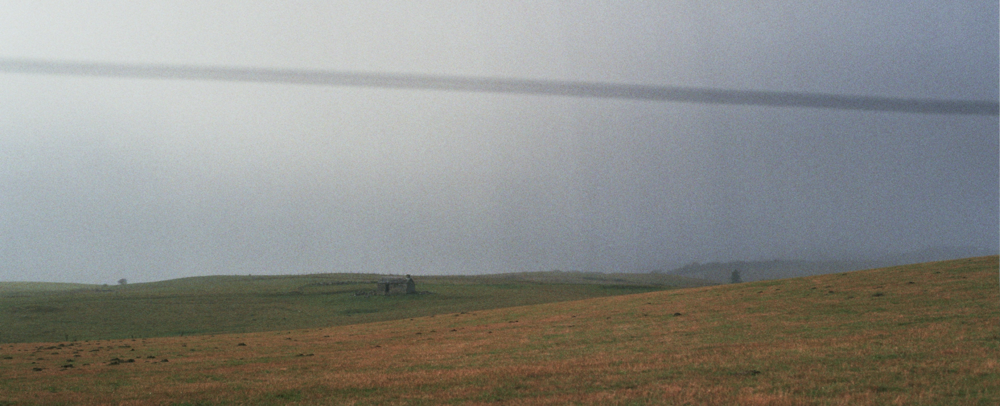

---

**Arthur Zwaenepoel** (Gent °1995)

{width=100%} 

I am currently a PhD student in the group of professor [Yves Van de
Peer](https://www.vandepeerlab.org/), conducting research on the
evolutionary importance of polyploidy. In practice I have mainly
worked on statistical phylogenetic methods for the inference of genome
duplications from comparative genomic data and modeling of gene family
evolution, where I have come to prefer a Bayesian approach towards
statistics. More broadly, I'd say I am interested in theoretical
biology and statistics. Besides my aspirations in science, I take a
strong interest in philosophy, music and literature. I enjoy computer
programming, playing music, long(ish)-distance running and traveling
by bicycle.

[notes](#notes) |
[publications](#publications) | 
[code](#code) |
[other](#other)

---

## Notes 

[Fisher's geometric model and the cost of
complexity](2021-08-05-fgm/fgm.html)

---

## Publications

*Published*:  
[Publications (scholar)](https://scholar.google.com/citations?user=8VSQd34AAAAJ)

*Preprints*:  
[A two-type branching process model of gene family
evolution](https://www.biorxiv.org/content/10.1101/2021.03.18.435925v1)
Arthur Zwaenepoel, Yves Van de Peer; 2021.03.18.435925; doi:
https://doi.org/10.1101/2021.03.18.435925

---

## Code

[Whale](https://github.com/arzwa/Whale.jl): Flexible Bayesian gene
tree reconciliation using amalgamated likelihood estimation and
probabilistic programming.

[Beluga](https://github.com/arzwa/Beluga.jl): Reversible-jump MCMC
for model-based inference of ancient WGD events using gene count
data.

[DeadBird](https://github.com/arzwa/DeadBird.jl): Statistical
analysis of comparative genomic data using phylogenetic birth-death
process models 

[wgd](https://github.com/arzwa/wgd): simple command line tools for
estimating $K_\mathrm{S}$ distributions, synteny analyses and
visualization of these things to unveil ancient WGD events.

... and more on [github](https://github.com/arzwa/wgd)

---

## Other

[bruine beer](https://bruinebeer.bandcamp.com/), featured on bandcamp
daily's 'Best New Ambient Music'
[here](https://daily.bandcamp.com/best-ambient/best-new-ambient-june-2018). Also see [vuilbak recordlabel](https://www.vuilbak.in), also
[here](https://vuilbak.github.io/).

A particularly nice [picture of my cat and me](img/ikenrik.jpg).

[discogs](https://www.discogs.com/user/dingelam),
[bandcamp](https://bandcamp.com/bruinebeer)

Other biographic trivia:

- Vegetarian, quasi-vegan
- Fairly experienced cook
- No driver's license, strongly opposed to all cars
- Favorite programming language: `julia`
- Favorite software tools: `pandoc`, `vim`, `cmus`
- Favorite authors (literature): W. F. Hermans, Hugo Claus, Vladimir Nabokov, Milan Kundera
- Cat person, dogs are OK

---

.
